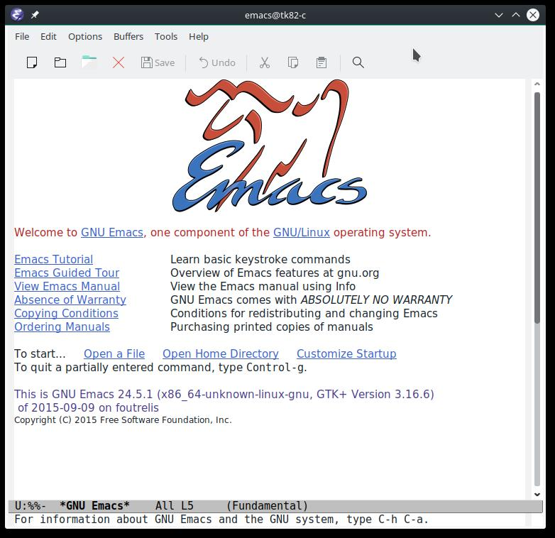
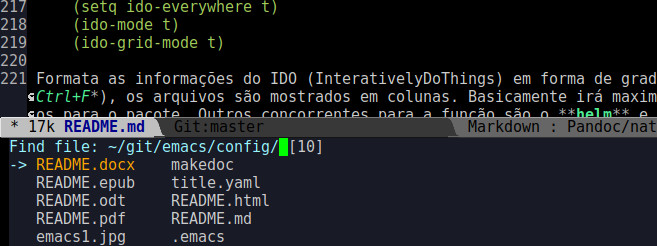
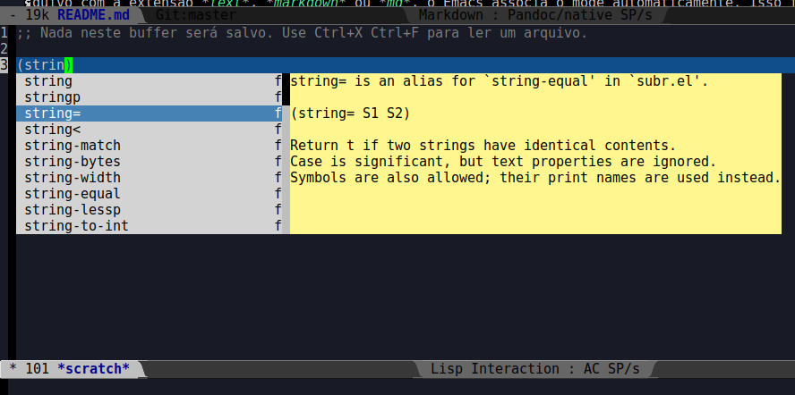
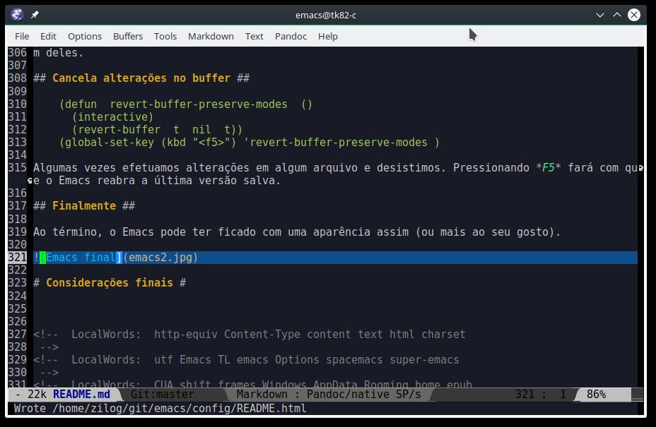
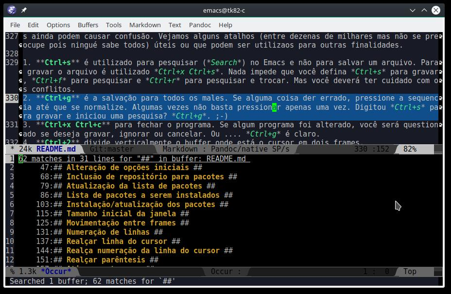

<meta http-equiv='Content-Type' content='text/html; charset=utf-8' />

# Emacs em 30 segundos #

__RASCUNHO - EM DESENVOLVIMENTO__
======================================================================

-------------------------------------------------------------------------------

TL;DR

Arquivo de configuração para o Emacs para ser utilizado em uma instalação nova ou substituir uma antiga. Automaticamente instala alguns pacotes definidos e configura o ambiente e os pacotes. Tudo bem explicadinho para ser alterado/melhorado facilmente. 

1. Baixe o arquivo [.emacs](.emacs), coloque no seu diretório *home* e abra o Emacs.
2. Baixe e leia a documentação em [epub](README.epub), [docx](README.docx), [pdf](README.pdf), [html](README.html) ou [odt](README.odt)

-------------------------------------------------------------------------------

Acredito que o maior problema para alguém iniciar com o Emacs está em como ele vem configurado inicialmente. Uma aparência relativamente simples e com teclas de atalhos diferentes das que os usuários estão acostumados (pelo menos as principais).
Muitas das configurações devem estar no arquivo *.emacs* o que implica em edição e a primeira decepção do usuário.

Existem algumas soluções para quem deseja iniciar no fabuloso mundo do Emacs. Para quem usa o *Vim*, uma boa alternativa pode ser o [spacemacs](https://github.com/syl20bnr/spacemacs). Como desvantagem tem a sua complexidade e curva de aprendizado para configurar. Outra opção é o [super-emacs](https://github.com/myTerminal/super-emacs) mas acho que também falham em alguns aspectos. Esconder o menu pode não ser uma boa ideia ou sobrepor atalhos CUA com shift setas para selecionar frames também não.

A ideia aqui é que o usuário apenas copie um arquivo e, ao executar o Emacs na primeira vez, o programa já seja apresentado com uma aparência mais agradável e com diversas ferramentas/opções não disponíveis/configuradas. Mas também é necessário que o usuário saiba o que foi feito, possa efetuar as alterações e incluir novas diretrizes. É o que pretendo colocar neste documento.

O arquivo de configuração *.emacs* ficou estruturado da seguinte forma:

1. agrupamento das alterações que também são efetuadas pelo menu **Options** para que não causem conflito em futuras alterações pelo menu;
2. definição de repositório e pacotes que serão instalados;
3. instalação dos pacotes não inclusos no emacs e configuração dos que acompanham a distribuição;
4. configuração dos pacotes internos e externos que não pertencem ao item 1.

Inicialmente o Emacs tem uma cara assim:

Ou seja, uma barra de ferramentas de gosto duvidoso (depois de um breve período de uso você usa os atalhos em vez de tirar a mão do teclado para clicar em um ícone daqueles) e uma tela de abertura com muita informação. Tudo isto irá mudar.

# Instalação #

Para instalar o Emacs, no Linux basta utilizar o comando para instalar pacotes (pacman, apt-get, etc.) e selecionar o Emacs. No Windows, baixe a última versão do Emacs do site [gnu](https://ftp.gnu.org/gnu/emacs/windows/), descompacte para alguma pasta e crie um link simbólico para o programa **runemacs**.

Para instalar deve estar conectado com a internet para que os pacotes necessários sejam baixados. Basta baixar o arquivo *.emacs* e colocá-lo na pasta do usuário. No Linux é **~/** ou **/home/nomeusuário** e no Windows é **c:\\Usuários\\nome\\AppData\\Rooming\\** (pelo menos em uma versão do Windows 8 que eu testei; não tenho Windows para saber como são as outras versões nem exatamente o que funciona ou não). 

# O arquivo de configuração #

O arquivo *.emacs* poderá ser alterado antes de executar o Emacs pela primeira vez. Use um editor de textos que você esteja acostumado. Se você desejar que o Emacs ignore alguma coisa, basta colocar **;** (ponto e vírgula) no início da linha. Vejamos o que possui em cada etapa da configuração.

## Alteração de opções iniciais ##

    (custom-set-variables
     '(cua-mode t nil (cua-base))
     '(custom-enabled-themes (quote (deeper-blue)))
     '(indicate-empty-lines t)
     '(show-paren-mode t)
     '(tool-bar-mode nil))
	 
Estas configurações poderiam estar em qualquer parte do arquivo *.emacs* mas eu resolvi deixar no início pois, quando o usuário efetuar alguma alteração pelo menu **Options** e selecionar **Options/Save Options** para torná-las permanentes, o Emacs irá alterar estas variáveis colocando mais informações. 

A primeira linha ativa o modo CUA (Common User Access) para que você não precise digitar *Alt+w* para copiar um texto, por exemplo. Pode utilizar o famoso *Crtl+C Ctrl+V*. Outra característica interessante que vem com o modo a a seleção em bloco. Você pressiona *Ctrl+Enter* e utiliza as setas para selecionar. Pode selecionar apenas uma coluna um um bloco maior. Depois pode utilizar as opções normais como copia, colar, excluir, sobrescrever, etc. *Ctrl+Enter*, novamente, para sair do modo de seleção em bloco.

A segunda linha especifica o tema inicial que será utilizado. Os temas podem ser vistos e alterados utilizando o menu **Options/Customize Emacs/Custom Themes**. Você pode, a qualquer momento alterar o tema e, se desejar, gravar para as próximas sessões.

A terceira opção irá preencher a janela do Emacs com um símbolo para indicar que não existem mais linhas após aquele ponto, mesmo em branco. Você poderá alterar a opção pelo menu **Options/Show/Hide/Fringe/Empty Line Indicators**. Lembre-se que se você fizer alguma alteração nas configurações, você deverá gravá-las pelo menu **Options/Save Options** se quiser que fiquem válidas para sessões futuras e elas irão alterar o arquivo *.emacs*..

A quarta opção irá salientar parêntesis, colchetes e chaves quando você estiver digitando um programa.

A quinta remove aquela barra de ferramentas que, em pouco tempo, apenas irá ocupar espaço na tela.

## Inclusão de repositório para pacotes ##

    (require 'package)
    (add-to-list 'package-archives
                 '("melpa" . "http://melpa.milkbox.net/packages/")
                 t)
    (package-initialize)

Adiciona o repositório MELPA que contém um maior número de pacotes e com uma atualização constante.

## Atualização da lista de pacotes ##

    (when (not package-archive-contents)
      (package-refresh-contents))

Faz exatamente isto. Atualiza a lista de pacotes do MELPA e do ELPA (repositório padrão do Emacs) para instalação posterior dos pacotes atualizados.

## Lista de pacotes a serem instalados ##

    (defvar gbm-required-packages
      '(powerline
        hlinum
        hiwin
        ido-grid-mode
        imenu-anywhere
        smex
        markdown-mode
        pandoc-mode
        auto-complete
        smartparens
        theme-looper))
    
Contém uma lista dos pacotes que serão instalados se necessário. A qualquer momento, você poderá incluir na lista qualquer pacote que desejar (desde que existam nos repositórios) e configurá-lo mais no final do arquivo *.emacs*. Adiante veremos o que cada um faz e as configurações atribuídas a eles.

## Instalação/atualização dos pacotes ##

    (mapc (lambda (p)
           (package-install p))
         gbm-required-packages)

Basicamente irá instalar ou atualizar os pacotes informados anteriormente.

# Configuração da aparência e pacotes #

Na sequencia vamos ver as configurações especificadas para o Emacs e para os diversos pacotes bem como seu significado.

## Tamanho inicial da janela ##

    (setq initial-frame-alist
          '(
            (width . 130) ; characters
            (height . 40) ; lines
            ))

Não gosto do tamanho inicial da janela. Acho que antiquado, meio do tempo quando os monitores eram restritos a 40/80 colunas. Com a resolução e os monitores wide, uma janela mais larga parece mais adequado.

## Movimentação entre frames ##

    (windmove-default-keybindings 'meta)

Para evitar que o usuário tenha que recorrer ao *Ctrl+O* para se mover entre as janelas ou retirar a mão do teclado para mover o ponteiro até a janela desejada e clicar, o processo se dá pelo pressionamento de *Alt+setas*. O foco irá passar para o frame adequado. O padrão em caso de omissão é *Shift+setas* porém iria conflitar com o CUA que utiliza estas sequencias para selecionar um texto. 

## Numeração de linhas ##

    (global-linum-mode t)

Informamos ao Emacs para numerar as linhas do buffer em qualquer frame aberto. Se não achar necessário, basta comentar. Quando desejar que um frame numere as linhas, digite *Alt-x*, *line-mode* e pressione *Enter*.

## Realçar linha do cursor ##

    (global-hl-line-mode t)
	
Informamos ao Emacs para realçar toda a linha onde encontra-se o cursor.

## Realça numeração da linha do cursor ##

    (require 'hlinum)
    (hlinum-activate)

Opção necessário caso haja numeração de linha e realce da linha sob o cursor. Faz com que a numeração também seja realçada.

## Realçar parêntesis ##

    (show-paren-mode)

Ativa o realce de abertura/fechamento de parêntesis ([{}])[]{}. Importante onde seja necessário confirmar a existência do par como em linguagens de programação. O caractere sob o cursor ficará em um fundo vermelho (se não existir a correspondência) ou azul (caso contrário). Cores dependem do tema escolhido.

## Ativa smartparens ##

    (use-package smartparens-config
        :ensure smartparens
        :config
        (progn
          (show-smartparens-global-mode t)))
     
    (add-hook 'prog-mode-hook 'turn-on-smartparens-strict-mode)
    (add-hook 'markdown-mode-hook 'turn-on-smartparens-strict-mode)

Modo que inclui automaticamente o fechamento de \[\(\{\". No caso de linguagens de programação, se for excluída uma linha contendo, por exemplo, a abertura de uma chave, a chave de fechamento correspondente será automaticamente excluída. O modo possui muitas facilidades. Para saber mais, leia o artigo [Emacs and Pairs](https://ebzzry.github.io/emacs-pairs.html).

## Esconde barra de rolamento ##

    (scroll-bar-mode -1)

Não vejo muita necessidade da barra de rolamento. Quando você está no início do arquivo, aparecerá *Top* na barra de status e quando você estiver no final aparecerá *Bottom*. Caso contrário será mostrado o percentual do arquivo anterior ao cursor.  Se você necessita, comente.

## Salva estado atual ao sair ##

    (require 'saveplace)
    (setq-default save-place t)
    (setq save-place-file "~/.emacs.d/saved-places")

Informa ao Emacs para salva a posição do cursor dos arquivos abertos. Na próxima vez que você abrir o arquivo, ele estará na posição que você estava.

## Desabilita buffer de mensagem inicial ##

    (setq initial-buffer-choice
        t)

Não mostrar o frame inicial com um monte de informações apenas para dizer que o Emacs possui muita coisa. :D

## Troca mensagem do buffer de rascunho ##

    (setq initial-scratch-message
        ";; Nada neste buffer será salvo. Use Ctrl+X Ctrl+F para ler um arquivo.")

Troquei a mensagem que aparece no buffer de rascunho. Mesmo que você tenha digitado algo nele, ele não será salvo automaticamente quando o Emacs for encerrado. O buffer é interessante pois permite anotações e avaliações de expressões em *elisp*. Se você digitar, por exemplo, *(\* 1 2 3 4 5)* e pressionar *Ctrl+J* terá como resposta *120*. 

## Realça frame ativo ##

    (require 'hiwin)
    (hiwin-activate)
    (set-face-background 'hiwin-face "black")

Para facilitar a visualização, o frame ativo fica com o fundo do tema escolhido. Os outros com um fundo preto. Se você escolher um tema com um fundo claro, pode ser mais interessante trocar o preto (*black*) por uma cor mais clara.

## Configura powerline ##

    (powerline-center-theme)
    (setq powerline-default-separator
          'wave)

Modifica a barra de status do Emacs deixando-a mais atraente e permite diversas configurações. Por exemplo, temos  como arrow, chamfer, curve, etc.

## ido no modo grade ##

    (setq ido-enable-flex-matching t)
    (setq ido-everywhere t)
    (ido-mode t)
    (ido-grid-mode t)

Formata as informações do IDO (InterativelyDoThings) em forma de grade e não linhas. Quando você vai abrir um arquivo (*Ctrl+X Ctrl+F*), os arquivos são mostrados em colunas. Basicamente irá maximizar a visualização dos itens. Existem diversos complementos para o pacote. Outros concorrentes para a função são o **helm** e **ivy**. Por enquanto o **ido** está de bom tamanho para o meu uso. Se você quiser saber um pouco mais sobre o *ido*, pode dar uma olhada em [Introduction to Ido Mode](https://www.masteringemacs.org/article/introduction-to-ido-mode).

Se o usuário digitar *Ctrl+x Ctrl+f* para abrir um arquivo, aparecerá um frame igual ao da imagem. É possível selecionar o arquivo utilizando as setas ou digitando-se o nome. Neste caso, os que não coincidirem com a pesquisa será escondidos facilitando a localização. Não é necessário digitar o inicio. Se digitar *yaml* salta direto para o arquivo com a extensão informada.

## Configura atalho *Ctrl+.* para imenu-anywhere ##

    (global-set-key (kbd "C-.") 'imenu-anywhere)

Procura no buffer atual procedimentos e funções (no caso de programas) ou títulos/capítulos/parágrafos e monta uma espécie de tabela de conteúdo, facilitando a movimentação pelo arquivo. Utiliza um frame do *ido* e está sujeito as mesmas funcionalidades.

## Configura atalhos *Alt+x* e *Alt+X* para smex ##

    (global-set-key (kbd "M-x") 'smex)
    (global-set-key (kbd "M-X") 'smex-major-mode-commands)

Atribui atalhos para a utilização do *smex*. Faz com que *Alt+X* mostre as opções em uma interface *ido* podendo compartilhar de todas as funcionalidades. Se o usuário procurar por *find-file* e executa, terá o mesmo funcionamento de *Ctrl+X Ctrl+F*. Também pode ser interessante para os curiosos descobrirem novos comandos. O que é uma coisa boa.

## Configura o autocomplete ##

    (ac-config-default)
    (ac-linum-workaround)

Bom para programadores pois irá completando automaticamente ou melhor, mostra um menu com as possibilidades mais prováveis, agilizando a digitação do programa. Possui diversos módulos para diversas linguagens. Muitos possuem ainda uma ajuda para a função. Como foi definida a numeração automática de linha em todos os buffers, a segunda linha evita que o menu seja numerado automaticamente. Por exemplo, em elisp:

## Configura o markdown ##

    (autoload 'markdown-mode "markdown-mode"
      "Major mode for editing Markdown files" t)
    (add-to-list 'auto-mode-alist '("\\.text\\'" . markdown-mode))
    (add-to-list 'auto-mode-alist '("\\.markdown\\'" . markdown-mode))
    (add-to-list 'auto-mode-alist '("\\.md\\'" . markdown-mode))

Markdown é um arquivo de marcação e é o que está sendo utilizado para escrever este documento. Sempre que o usuário abrir um arquivo com a extensão *text*, *markdown* ou *md*, o Emacs associa o mode automaticamente. Isso faz com que a sintaxe seja salientada de acordo com o conteúdo do  arquivo bem como, neste caso, cria um menu específico com o nome **Markdown** que o usuário pode acessar para efetuar diversas tarefas relativas ao formato como marcar como *itálico*, **bold**, *títulos*, etc.. Posteriormente o arquivo poderá gerar um *.html* sem muito esforço (é necessário que o programa *markdown* para seu ambiente esteja instalado). Com outros utilitários (veremos o *pandoc* adiante) é possível mais proezas ainda a um custo bastante baixo.

## Configura pandoc ##

    (load "pandoc-mode")
    (add-hook 'markdown-mode-hook 'pandoc-mode)

Agora a coisa ficou mais legal. Apesar da documentação meio sofrível, o *pandoc* é um bom programa para lidar com formatos de documentos permitindo a conversão entre eles bem como a geração de formatos específicos. Para alguns formatos, utiliza programas complementares. Para gerar *html* utiliza o markdown, para o *pdf* o latex, etc.. Este texto, por exemplo, está sendo digitado em markdown *README.md*. Será utilizado diretamente no [github](https://github.com/guaracy/emacs/tree/master/config) e irá gerar um *pdf*, um *docx*, um *epub*, um *html* e um *odt* com o mesmo conteúdo. Até poderiam ser gerados outros, provavelmente sem muita utilidade para o usuário. Não chega a ser uma panaceia mas facilita bastante o trabalho de quem precisa entregar documentos diversos. Neste caso específico, criei um arquivo auxiliar (*title.yaml* que pode ser visto abaixo) para formatar uma capa e um script com linhas do tipo `pandoc -S --toc -o README.pdf title.yaml README.md` para gerar os diversos formatos.

    ---
    title: Emacs em 30 segundos
    author: Guaracy Monteiro
    date: Jan/16
    rights:  Creative Commons Non-Commercial Share Alike 3.0
    language: pt-BR
    ...

Para a produção de um livro mais sofisticado é necessário que o usuário utilize alguns arquivos/programas de suporte. O livro [Pro Git](https://progit.org/), por exemplo, foi feito utilizando *markdown* e diversos utilitários. Para produzir a versão em *pdf*, foi utilizado o *pandoc* para gerar o LaTeX. Você pode ver/baixar os [fontes](https://github.com/progit/progit) no GitHub e adaptar para o seu projeto.

## Configura theme-looper ##

    theme-looper-set-theme-set '(adwaita
                                 deeper-blue
                                 dichromacy
                                 misterioso
                                 tango-dark
                                 tango
                                 tsdh-dark
                                 wheatgrass
                                 wombat))
    (theme-looper-set-customizations 'powerline-reset)
    (global-set-key (kbd "C-\"") 'theme-looper-enable-next-theme)

Apenas para facilitar a visualização dos temas para ver qual fica melhor ou lhe agrada mais. Se você incluir um novo tema, deverá colocá-lo manualmente na lista para que seja reconhecido. Foi atribuído o atalho *Ctrl+"* para alternar entre os temas.

## Arquivos recentes ##

    (require 'recentf)
    (recentf-mode t)
    (setq recentf-max-menu-items 25)
    (defun recentf-ido-find-file ()
      "Find a recent file using Ido."
      (interactive)
      (let ((file (ido-completing-read "Choose recent file: " recentf-list nil t)))
        (when file
          (find-file file))))
    (global-set-key (kbd "C-x C-r") 'recentf-ido-find-file)

Aqui dizemos ao Emacs para lembra-se dos últimos 25 arquivos abertos (poderia ser outro número). Os arquivos ficarão acessíveis no menu **File/Open Recent** ou pelo atalho *Ctrl+x Ctrl+r* onde abrirá um frame do *ido* colocando o nome dos arquivos, facilitando a reabertura de qualquer um deles. 

## Cancela alterações no buffer ##

    (defun  revert-buffer-preserve-modes  ()
      (interactive)
      (revert-buffer  t  nil  t))
    (global-set-key (kbd "<f5>") 'revert-buffer-preserve-modes )

Algumas vezes efetuamos alterações em algum arquivo e desistimos. Pressionando *F5* fará com que o Emacs reabra a última versão salva. 

## Finalmente ##

Ao término, o Emacs pode ter ficado com uma aparência assim (ou mais ao seu gosto).

# Considerações finais #

O que vem a seguir não é referente ao arquivo de configuração *.emacs*.

## Atalhos ##

Apesar do CUA facilitar a memorização de alguns atalhos para quem vem de outros editores, outros ainda podem causar confusão. Vejamos alguns atalhos (entre dezenas de milhares mas não se preocupe pois ninguém sabe todos) úteis ou que podem ser utilizados para outras finalidades.

1. **Ctrl+s** é utilizado para pesquisar (*Search*) no Emacs e não para salvar um arquivo. Pressionando *Ctrl+s* novamente, o cursor irá para a próxima ocorrência. Para gravar o arquivo é utilizado *Ctrl+x Ctrl+s*. Nada impede que você defina *Ctrl+s* para gravar, *Ctrl+f* para pesquisar e *Ctrl+r* para pesquisar e trocar. Mas você deverá ter cuidado com os conflitos.
2. **Ctrl+g** é a salvação para todos os males. Se alguma coisa der errado, pressione a sequencia até que se normalize. Algumas vezes não basta pressionar apenas uma vez. Digitou *Ctrl+s* para gravar e iniciou uma pesquisa? *Ctrl+g*. ;-)
3. **Ctrl+x Ctrl+c** para fechar o programa. Se algum programa foi alterado, você será questionado se deseja gravar, ignorar ou cancelar. Ou .... *Ctrl+g* é claro.
4. **Ctrl+2** divide verticalmente o buffer onde está o cursor em dois frames.
5. **Ctrl+3** divide horizontalmente o buffer onde o cursor se encontra.
6. **Ctrl+1** faz com que o buffer onde está o cursor ocupe toda a janela.
7. **Ctrl+0** o buffer atual cederá espaço para os outros frames. 
8. **Ctrl+x b** abre um frame (*ido*) para que o usuário selecione outro buffer.
9. **Ctrl+x k** fecha o buffer atual. Se o arquivo foi alterado, o usuário será perguntado se deseja salvar/etc. ou **Ctrl+g**.
10. **Home** e **End** servem para ir ao início ou final da linha, precedidos de **Ctrl** para o início ou final do arquivo, precedidos de **Shift** da posição atual até o início ou final da linha ou do arquivo se o **Ctrl** também for pressionado.

## comandos ##

### *Alt+x occur* ###

Permite que você informe um texto (pode ser expressão regular) e será aberto um frame informando todas as ocorrência no seu arquivo para que você tenha acesso rápido aos diversos pontos.

<!--  LocalWords:  http-equiv Content-Type content text html charset
 -->
<!--  LocalWords:  utf Emacs TL emacs Options spacemacs super-emacs
 -->
<!--  LocalWords:  CUA shift frames Windows AppData Rooming home epub
 -->
<!--  LocalWords:  README docx pdf rtf odt alt jpg pacman apt-get not
 -->
<!--  LocalWords:  link runemacs custom-set-variables cua-mode Save
 -->
<!--  LocalWords:  cua-base custom-enabled-themes deeper-blue Common
 -->
<!--  LocalWords:  indicate-empty-lines show-paren-mode tool-bar-mode
 -->
<!--  LocalWords:  User Access Crtl Ctrl Custom Themes Line package
 -->
<!--  LocalWords:  Indicators add-to-list package-archives melpa when
 -->
<!--  LocalWords:  package-initialize package-archive-contents ELPA
 -->
<!--  LocalWords:  package-refresh-contents defvar powerline hlinum
 -->
<!--  LocalWords:  gbm-required-packages hiwin ido-grid-mode smex and
 -->
<!--  LocalWords:  imenu-anywhere markdown-mode pandoc-mode mapc setq
 -->
<!--  LocalWords:  auto-complete smartparens theme-looper width lines
 -->
<!--  LocalWords:  package-install initial-frame-alist characters kbd
 -->
<!--  LocalWords:  height wide windmove-default-keybindings frame M-x
 -->
<!--  LocalWords:  global-linum-mode buffer Alt-x line-mode ensure md
 -->
<!--  LocalWords:  global-hl-line-mode hlinum-activate use-package
 -->
<!--  LocalWords:  smartparens-config config progn add-hook Pairs let
 -->
<!--  LocalWords:  show-smartparens-global-mode prog-mode-hook Bottom
 -->
<!--  LocalWords:  turn-on-smartparens-strict-mode markdown-mode-hook
 -->
<!--  LocalWords:  scroll-bar-mode saveplace setq-default save-place
 -->
<!--  LocalWords:  save-place-file initial-buffer-choice elisp black
 -->
<!--  LocalWords:  initial-scratch-message hiwin-activate hiwin-face
 -->
<!--  LocalWords:  set-face-background powerline-center-theme wave
 -->
<!--  LocalWords:  powerline-default-separator ido-everywhere mode
 -->
<!--  LocalWords:  ido-enable-flex-matching ido-mode global-set-key
 -->
<!--  LocalWords:  smex-major-mode-commands markdown autoload editing
 -->
<!--  LocalWords:  auto-mode-alist ac-config-default pandoc load Find
 -->
<!--  LocalWords:  ac-linum-workaround theme-looper-set-theme-set C-x
 -->
<!--  LocalWords:  adwaita dichromacy tango-dark tsdh-dark wheatgrass
 -->
<!--  LocalWords:  wombat theme-looper-set-customizations recentf C-r
 -->
<!--  LocalWords:  powerline-reset theme-looper-enable-next-theme ivy
 -->
<!--  LocalWords:  recentf-mode recentf-max-menu-items defun recent
 -->
<!--  LocalWords:  recentf-ido-find-file using interactive Choose
 -->
<!--  LocalWords:  ido-completing-read recentf-list find-file arrow
 -->
<!--  LocalWords:  revert-buffer-preserve-modes revert-buffer chamfer
 -->
<!--  LocalWords:  InterativelyDoThings helm Introduction yaml bold
 -->
<!--  LocalWords:  buffers latex github title script toc author Jan
 -->
<!--  LocalWords:  Guaracy rights Creative Commons Non-Commercial Git
 -->
<!--  LocalWords:  Share Alike language pt-BR LaTeX GitHub Open End
 -->
<!--  LocalWords:  Search occur
 -->
